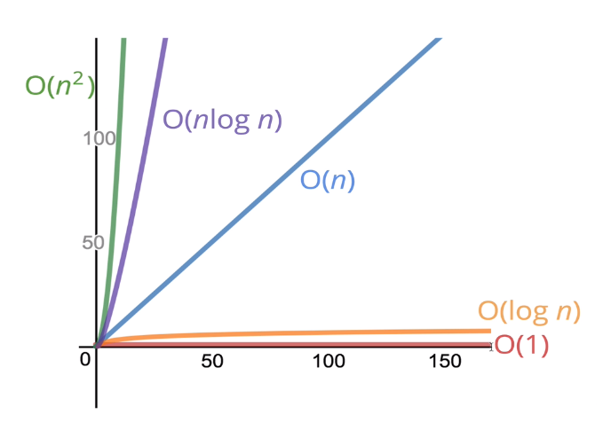

## 섹션2 : 빅오 표기법 (Big O Notation)

- 빅오 표기법의 필요성
- 빅오란 무엇인가
- 빅오 표기법을 간단하게 표현하는 방법
- "시간 복잡도"와 "공간 복잡도"의 정의
- 빅오 표기법을 사용하여 여러가지 알고리즘 평가
- 로그란 무엇인가

---

### 빅오 표기법의 필요성
- 코드의 성능을 이야기할 때 정확한 전문용어를 사용할 수 있다.
- 여러 접근법의 장단점을 이야기할 때 유용하다.
- 비효율적인 코드를 찾는데 도움이 된다.
- 면접에 자주 나오는 내용이기 때문에 중요하다.

---

### 빅오
- 대략적으로 숫자를 세는 것에 붙인 공식적인 표현
- 입력의 크기와 실행시간의 관계 (전반적인 추세)

---

### 시간복잡도 (Time Complexity)
: 입력이 커질수록 알고리즘의 실행 속도가 어떻게 바뀌는지 분석

**예시 1)** O(1) (연산자 3개)
```jsx
    function addUpTo(n){
        return n * (n + 1) / 2;
    }
```

**예시 2)** O(n) (연산자 10n개씩 증가)
```jsx
    function addUpTo(n){
        let total = 0;
        for (let i=1; i<=n; i++){
            total += i;
        }
        return total;
    }
```

**예시 3)** O(n) (연산자 10n개씩 증가)
```jsx
    function countUpAndDown(n){
        console.log("Going up!");
        for (var i=0; i<n; i++){
            console.log(i);
        }
        console.log("At the top! Going down...");
        for (var j=n-1; j>=0; j--){
            console.log(j);
        }
        console.log("Back down. Bye!");
    }
```
**예시 4)** O(n^2) (연산자 n^2개씩 증가)
```jsx
    function printAllParis(n){
        for (var i=0; i<n; i++){
            for (var j=0; j<n; j++){
                console.log(i, j);
            }
        }
    }
```

빅오 정리
- 산수는 상수
- 변수할당은 상수
- 인덱스를 사용하여 배열 엘리먼트에 접근하는 것은 상수
- 루프(loop)내에서 루프의 개수만큼 n이 늘어남



---

### 공간복잡도 (Space Complexity)
: 입력이 커질수록 알고리즘이 얼마나 많은 공간을 차지하는지 분석

- 대부분의 원시값(booleans, numbers, undefined, null)은 불변 공간
- 문자열은 O(n)만큼의 공간 필요
- 배열, 객체도 O(n)만큼의 공간 필요

**예시 1)** O(1) (숫자 2개)
```jsx
    function sum(arr){
        let total = 0; // 여기
        for (let i=0; i<arr.length; i++){ //i=0 여기
            total +=arr[i];
        }
        return total;
    }
```

**예시 2)** O(n) (숫자 n개)
```jsx
    function double(arr){
        let newArr = [];
        for (let i=0; i<arr.length; i++){
            newArr.push(2 * arr[i])
        }
        return newArr; // newArr 여기
    }
```

**예시 3)** O(n) (숫자 n개)
```jsx
    function subtotals(array) {
    var subtotalArray = Array(array.length);
    for (var i = 0; i < array.length; i++) {
        var subtotal = 0;
        for (var j = 0; j <= i; j++) {
            subtotal += array[j];
        }
        subtotalArray[i] = subtotal;
    }
    return subtotalArray;
}
```


