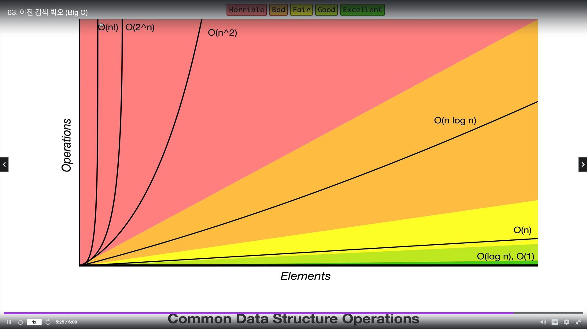

## 섹션10 : 검색 알고리즘

- 검색 알고리즘이 무엇인지 설명할 수 있다.
- 배열에 선형 검색(liner search) 실시
- 분류된 배열에서의 이진 검색(binary search) 실시
- 나이브(navie) 문자열 검색 알고리즘 실시
- KMP 문자열 검색 알고리즘 실시

---

### 선형검색 (Linear Search)

javascript 내장 메서드 : 한 번에 하나의 항목 확인

- indexOf
- includes
- find
- findIndex

---

### 연습 24. Linear Search Exercise

Write a function called linearSearch which accepts an array and a value, and returns the index at which the value exists. If the value does not exist in the array, return -1.

Don't use indexOf to implement this function!

**Examples:**

```js
linearSearch([10, 15, 20, 25, 30], 15); // 1
linearSearch([9, 8, 7, 6, 5, 4, 3, 2, 1, 0], 4); // 5
linearSearch([100], 100); // 0
linearSearch([1, 2, 3, 4, 5], 6); // -1
linearSearch([9, 8, 7, 6, 5, 4, 3, 2, 1, 0], 10); // -1
linearSearch([100], 200); // -1
```

The soultion is...

```js
function linearSearch(arr, val) {
  for (var i = 0; i < arr.length; i++) {
    if (arr[i] === val) return i;
  }
  return -1;
}

linearSearch([34, 51, 1, 2, 3, 45, 56, 687], 100);
```

---

### 이진검색 (Binary Search)

- 훨씬 더 빠르게 작업 수행이 가능하다.
- 한 번에 하나의 항목만 제거하는 것보다 훨씬 빠를 수 있다.
- 분류된 배열을 대상으로만 작동하므로 데이터라 분류되어 있어야 한다.

  +) 22.07.28 스터디 이진검색 관련 문제풀이 (코플릿 섹션3 9번)

---

### Binary Search Pseudocode

- This function accpets a sorted array and a value
- Create a left pointer at the start of the array, and a right pointer at the end of the array
- While the left pointer comes before the right pointer:
- Create a pointer in the middle
  - If you find the value you want, return the index
  - If the value is too small, move the left pointer up
  - If the value is too large, move the right pointer down
- ## If you never find the value, return -1

### 연습 25. Binary Search Exercise

Write a function called binarySearch which accepts a sorted array and a value and returns the index at which the value exists. Otherwise, return -1.

This algorithm should be more efficient than linearSearch - you can read how to implement it here - https://www.khanacademy.org/computing/computer-science/algorithms/binary-search/a/binary-search and here - https://www.topcoder.com/community/data-science/data-science-tutorials/binary-search/

**Examples:**

```js
binarySearch([1, 2, 3, 4, 5], 2); // 1
binarySearch([1, 2, 3, 4, 5], 3); // 2
binarySearch([1, 2, 3, 4, 5], 5); // 4
binarySearch([1, 2, 3, 4, 5], 6); // -1
binarySearch(
  [
    5, 6, 10, 13, 14, 18, 30, 34, 35, 37, 40, 44, 64, 79, 84, 86, 95, 96, 98, 99,
  ],
  10
); // 2
binarySearch(
  [
    5, 6, 10, 13, 14, 18, 30, 34, 35, 37, 40, 44, 64, 79, 84, 86, 95, 96, 98, 99,
  ],
  95
); // 16
binarySearch(
  [
    5, 6, 10, 13, 14, 18, 30, 34, 35, 37, 40, 44, 64, 79, 84, 86, 95, 96, 98, 99,
  ],
  100
); // -1
```

The solution is...

```js
// Original Solution
function binarySearch(arr, elem) {
  var start = 0;
  var end = arr.length - 1;
  var middle = Math.floor((start + end) / 2);
  while (arr[middle] !== elem && start <= end) {
    if (elem < arr[middle]) {
      end = middle - 1;
    } else {
      start = middle + 1;
    }
    middle = Math.floor((start + end) / 2);
  }
  if (arr[middle] === elem) {
    return middle;
  }
  return -1;
}

// Refactored Version
function binarySearch(arr, elem) {
  var start = 0;
  var end = arr.length - 1;
  var middle = Math.floor((start + end) / 2);
  while (arr[middle] !== elem && start <= end) {
    if (elem < arr[middle]) end = middle - 1;
    else start = middle + 1;
    middle = Math.floor((start + end) / 2);
  }
  return arr[middle] === elem ? middle : -1;
}

binarySearch([2, 5, 6, 9, 13, 15, 28, 30], 103);
```

### 이진 검색 빅오(big O)


