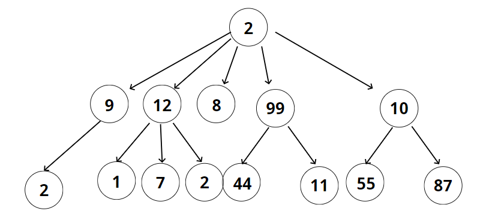
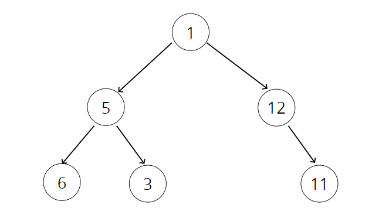
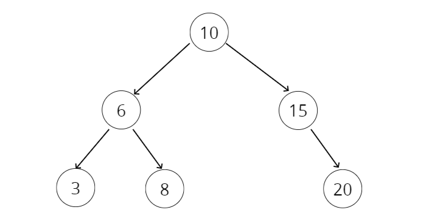

## 섹션22 : 이진 검색 트리
- Define what a tree is
- Compare and contrast trees and lists
- Explain the differences between trees, binary trees, and binary search trees
- Implement operations on binary search trees(BST)

---
### WHAT IS A TREE?
- A data structure that consists of nodes in a parent / child relationship
- ex)

- Lists - linear
- Trees - nonlinear

---
TREE TERMINOLOGY
- Root - The top node in a tree.
- Child -A node directly connected to another node when moving away from the Root.
- Parent - The converse notion of a child.
- Siblings -A group of nodes with the same parent.
- Leaf - A node with no children.
- Edge - The connection between one node and another.

---
Lots of different applications!

- HTML DOM
- Network Routing
- Abstract Syntax Tree
- Artificial Intelligence
- Folders in Operating Systems
- Computer File Systems

---
KINDS OF TREES
- Trees
- Binary Trees 

- Binary Search Trees (BSTS)

---
HOW BSTS WORK
- Every parent node has at most **two** children
- Every node to the left of a parent node is **always less** than the parent
- Every node to the right of a parent node is **always greater** than the parent

---
INSERTING A NODE
Steps - Iteratively or Recursively

- Create a new node
- Starting at the root
- Check if there is a root, if not - the root now becomes that new node!
- If there is a root, check if the value of the new node is greater than or less than the value of the root
- If it is greater 
    - Check to see if there is a node to the right
        - If there is, move to that node and repeat these steps
        - If there is not, add that node as the right property
- If it is less
    - Check to see if there is a node to the left
        - If there is, move to that node and repeat these steps
        - If there is not, add that node as the left property